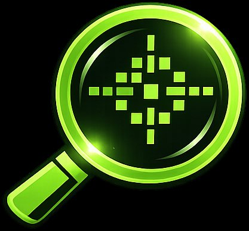

# Lucid

> Browser-based image enhancement, analysis, and forensics tool for investigators and analysts.

---

## Overview

**Lucid** is a client-side image intelligence platform built for digital forensics investigators, OSINT analysts, and anyone who needs to examine images in detail. It provides professional-grade enhancement, annotation, metadata extraction, and reverse image search — all running entirely in the browser with no server-side processing.

---

## Features

- **Real-time Enhancement** — Brightness, contrast, saturation, gamma, color balance, interactive curves editor, Gaussian unsharp mask with radius/threshold control, and nine presets — four of which (Smart Auto, Auto Levels, Auto Color, Low Light) are adaptive, computing their values from the image histogram and writing them into the sliders for full auditability
- **Forensic Filters** — CLAHE (contrast-limited adaptive equalization), auto white balance, dehaze (dark channel prior), edge detection, emboss, histogram equalization, grayscale, invert, and denoise
- **Forensic Analysis** — Error Level Analysis (ELA) for manipulation screening, JPEG quantization-table fingerprinting with estimated encoder quality, and embedded EXIF thumbnail comparison
- **Perspective Correction** — Click four corners of a document, screen, or plate photographed at an angle and warp it flat
- **ML Super-Resolution** — Neural upscaling in-browser via ONNX Runtime Web with WebGPU acceleration (WASM fallback, worker-proxied so the UI never blocks): a built-in 3x Sub-Pixel CNN, the recommended RealESR-general 4x compact (~5 MB), Real-ESRGAN x4plus (~67 MB) — all SHA-256-verified, cached locally for offline reuse, and savable to disk — or load your own `.onnx`. A dedicated TEXT & PLATES mode wraps the model in denoise → SR → iterative back-projection → stroke-tuned sharpening; optional double-pass for tiny crops and an x8 self-ensemble for maximum quality. After upscaling, a split-slider shows a direct neural-vs-bicubic A/B
- **Case Report Export** — One click produces a self-contained HTML report: SHA-256 of the source file and working render, original and processed images, the complete processing audit trail, active settings, and extracted metadata. Archivable alongside the evidence and printable to PDF
- **Offline / PWA** — A service worker caches the app shell, CDN libraries, OCR language data, and downloaded models: after one online session, Lucid runs with the network unplugged. Set `LUCID_THREADS=1` on the server to enable cross-origin isolation for multithreaded WASM (~4-8x faster CPU inference; disables the inline GPS map embed)
- **Annotation Tools** — Draw shapes, arrows, text labels, blur sensitive regions, and measure pixel distances
- **Unified Undo/Redo** — Every operation (annotations, blurs, filters, crops, warps, presets) on a single chronological history with a session audit trail
- **Metadata & OSINT** — Full EXIF/IPTC/ICC/XMP extraction (JPEG, PNG, TIFF, HEIC), SHA-256 hashing, GPS mapping with inline OpenStreetMap embed, raw tag dump, OCR text extraction, reverse image search via Google Lens, Yandex, TinEye, and Bing, and region OCR (drag a box to read just a plate or sign)

---

## How to Use

### About the App

Load an image via file upload, clipboard paste, or URL. The main canvas displays your image with real-time enhancements applied. Use the tabbed sidebar on the right to access enhancement controls, transform tools, magnifier settings, annotation tools, OSINT utilities, and metadata. All processing happens client-side — nothing is uploaded to any server.

### Interface

| Area | Description |
|------|-------------|
| **Header Bar** | File operations, view toggles, export controls, and image info |
| **Sidebar** | Tabbed control panel with Enhance, Transform, Magnify, Annotate, OSINT, and Metadata tabs |
| **Canvas** | Main image display with annotation and overlay layers |
| **Status Bar** | Cursor coordinates, pixel RGB values, and picked color display |

### Keyboard Shortcuts

| Shortcut | Action |
|----------|--------|
| `A` | Toggle annotation visibility |
| `M` | Toggle magnifier |
| `P` | Activate color picker |
| `R` / `C` / `B` / `T` / `L` / `U` | Select tool: Rect / Circle / Blur / Text / Line / Measure |
| `Esc` | Deselect tool / cancel perspective correction |
| `Space + Drag` | Pan when zoomed |
| `\` (hold) | Compare with the unmodified original |
| `Ctrl+Z` | Undo last operation |
| `Ctrl+Shift+Z` | Redo |
| `Ctrl+V` | Paste image from clipboard |
| `Scroll` | Zoom toward cursor |

You can also drag and drop an image file directly onto the canvas to load it.

> On macOS, substitute `Ctrl` with `Cmd`.

---

## Notes

- Requires a modern browser with ES6 module support (Chrome, Firefox, Safari, Edge)
- Minimum screen width of 1024px required for full functionality
- All image data is processed locally in the browser and never leaves your machine
- Supported formats: JPG, PNG, GIF, BMP, WebP, TIFF, HEIC/HEIF

---

  Part of Project Eyrie — by <a href="https://notalex.sh">notalex.sh</a>

